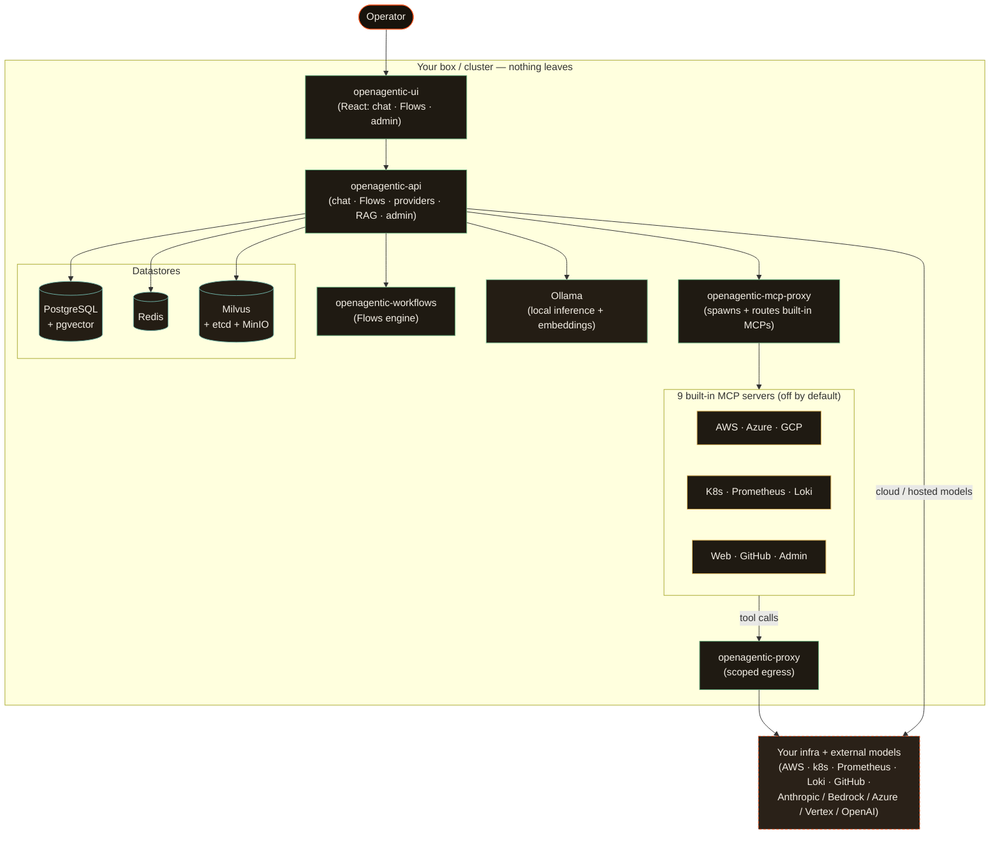

# Overview

**OpenAgentic** is an open-source, self-hosted agentic platform for IT operations. It gives you chat, visual ops **Flows**, RAG and memory, and admin dashboards — backed by first-party MCP servers that *actually touch* your AWS, Kubernetes, Prometheus, and Loki — running entirely on your own hardware. It is model-agnostic, ships **zero telemetry**, and authenticates against a local user store. Nothing about your infrastructure leaves the box.

This page explains what OpenAgentic is, who it is for, what you can do with it, how the pieces fit together, where the open-source boundary sits, and what a session actually looks like.

---

## What OpenAgentic is

OpenAgentic is a complete ops platform you run yourself with a single `docker compose --profile milvus up -d` (or one Helm install). It is licensed [Apache-2.0](../../LICENSE) and built and maintained by **Agenticwork™ LLC**.

The platform is made of a small set of cooperating services:

| Service | Purpose |
|---|---|
| `openagentic-api` | Platform API — chat, Flows, providers, RAG, admin |
| `openagentic-ui` | React UI — chat, Flows, admin console |
| `openagentic-workflows` | Workflow / Flows engine |
| `openagentic-mcp-proxy` | Spawns and routes the built-in MCP servers |
| `openagentic-proxy` | Egress proxy for agent tool calls / sub-agent dispatch |
| `openagentic-ollama` | Optional custom Ollama image with model pre-pull |
| `shared` | Cross-service types and utilities |

These run alongside the datastores OpenAgentic depends on: **PostgreSQL** (with the `pgvector` extension) for relational data, **Redis** for caching and inter-service state, **Milvus** (with etcd + MinIO) for the semantic vector index, and an **Ollama** host for local inference and embeddings.

---

## Why — the value proposition

Most credible AI-for-ops tools today are closed SaaS: to do their job they want to **ingest your infrastructure logs** into someone else's model. For a DORA-regulated bank, anything touching PHI, a government system, or anything under EU/NIS2, that is frequently a non-starter — you may be *legally forbidden* from shipping those logs off-box, and you are paying a rising observability bill on top.

OpenAgentic takes the opposite position on every axis that matters for sovereignty-bound teams:

- **Self-hosted, forever free.** One box you can fork, audit, and run on your own hardware. The OSS core is complete — no paywalls, no locked admin screens, no 402 walls, no "demo mode" flags, no usage caps.
- **Model-agnostic.** Run free local inference via **Ollama**, or plug in **Anthropic**, **OpenAI**, **Azure OpenAI**, **Azure AI Foundry**, **AWS Bedrock**, or **Google Vertex AI**. No model IDs are hardcoded in the platform — providers and models are discovered and registry-driven.
- **Zero telemetry.** No phone-home, no client-side beacons, nothing. (See the [zero-telemetry proof](../zero-telemetry.md) for what was checked and how to verify it yourself.)
- **Your data never leaves.** Tool calls touch *your* clouds and clusters directly through MCP servers you run; egress goes through a controlled, auditable proxy.
- **A trust moat built at the infrastructure level, not the prompt level.** Mutating actions wait behind a human approval gate, and every action — proposed and executed — lands in an append-only audit log.

---

## Who it's for (the ICP)

OpenAgentic is built for the **platform / SRE lead at a sovereignty-bound organization** who wants an AI ops platform they can self-host, audit, and trust — and who is done with both the compliance risk and the bill-shock of SaaS observability and AI-SRE tooling.

If you operate AWS, Kubernetes, Prometheus, and Loki, want chat + visual ops Flows + RAG over your own infra, and cannot send your logs to a third-party model, OpenAgentic is aimed squarely at you. The OSS edition is designed around a **single local user** (username/password + JWT + API keys) — multi-user directory integration is an enterprise concern (see the boundary below).

---

## What you can do

### Chat with ops MCPs
Talk to your infrastructure in natural language. Ask *"List my Kubernetes pods that aren't ready"* or *"What's spiking in Prometheus right now?"* and the agent calls the relevant MCP tools, in parallel where it helps, and answers with the evidence. Chat keeps persistent history and supports semantic search over past conversations and uploaded documents.

### Build Flows
**Flows** are visual agent runbooks. On a drag-and-drop canvas you wire nodes, branching, tool calls, and RAG into a repeatable loop — the whole agentic pipeline, made inspectable and re-runnable.

### Run agents against real systems
The built-in MCP servers don't just describe your infra — they touch it. Cloud, ops, and knowledge MCPs let agents query and (behind the approval gate) act on AWS, Azure, GCP, Kubernetes, Prometheus, Loki, GitHub, the web, and the platform's own admin surface.

### See what's happening
The admin console gives you live, Prometheus-driven dashboards on usage, cost, and model behavior — all in-box, never phoned home.

---

## The built-in MCP servers

OpenAgentic ships **9 first-party MCP servers**. The MCP proxy (`openagentic-mcp-proxy`) spawns these as subprocesses and wires them in `mcp_manager.initialize_servers`. They live under `services/mcps/oap-*-mcp/`.

| Group | Servers |
|---|---|
| **Cloud** | AWS · Azure · GCP |
| **Ops** | Kubernetes · Prometheus · Loki |
| **Knowledge / Meta** | Web · GitHub · Admin |

A few notes that matter operationally:

- **All are disabled by default** — you enable the ones you need.
- **Web, GitHub, and Admin need no credentials.** The cloud MCPs (AWS, Azure, GCP) authenticate from `~/.openagentic/cloud-secrets/*.env`, or from your host's mounted CLI credentials (`~/.aws`, `~/.azure`, `~/.config/gcloud`, `~/.kube/config`) which the installer mounts read-only into the proxy.
- **Routing is semantic.** Tools are indexed in Milvus by their descriptions, so you can have every MCP active at once and the agent still selects the right tool for the request.
- **You can add your own.** Paste any Claude-Desktop-format JSON MCP config into the admin panel and the proxy installs and indexes it alongside the built-ins.

---

## Architecture at a glance

**The request path, in words:** you talk to the UI; the UI calls the API; the API picks a model via the **SmartModelRouter** (always on — see below), runs the chat or Flow loop, and when the agent wants a tool it asks the MCP proxy. The proxy spawns and routes the right built-in MCP, whose calls leave through the scoped egress proxy to your actual clouds and clusters. PostgreSQL holds relational data, Redis holds cache/state, and Milvus holds the semantic indexes used for tool selection and RAG. Ollama provides free local inference and the `nomic-embed-text` embeddings; hosted providers are reached directly when configured.

### Model routing is automatic

OpenAgentic's **SmartModelRouter** is always on. It discovers models from every configured provider at startup, stores their capabilities in Milvus, and routes each request to the best-fit model based on task complexity (simple chat vs. tool calling vs. multi-step reasoning), model capabilities, cost, and provider health. Because of this, **API request bodies should not pin a `model` field** — let the router choose. There are no hardcoded model IDs in the platform; everything is registry- and seeder-driven. Embeddings run through Ollama (`nomic-embed-text` by default), and image generation routes through the dedicated image-gen role (e.g. AWS Bedrock Nova / Titan / Stability) when configured.

---

## The trust moat

This is the part that lets you actually run an agent against production. It is enforced in the platform, not asked for in a prompt:

- **Human approval on every write.** The agent investigates and *recommends*; nothing that mutates your infrastructure runs until you click **Approve**. (Implemented in the API's tool approval gate.)
- **Immutable audit log.** Every action — proposed and executed — lands in an append-only record.
- **Scoped egress proxy.** Tool calls leave through a controlled, auditable path rather than arbitrary outbound network access.

The honest answer to *"what if the AI deletes our prod database?"* is: it doesn't get to. It investigates, recommends, and waits for a human. OpenAgentic does not promise autonomous auto-healing — it promises **control**.

---

## Authentication

The OSS edition uses **local authentication only**: a username/password user store, JWTs, and API keys. Local login is always registered at `/api/auth/local/*`. There is **no SSO, AAD/Entra, OBO, or MFA** in the open-source edition — those are enterprise concerns. The installer seeds a single admin user (default `admin@openagentic.local`) with a strong random password written to `~/.openagentic/admin-credentials.txt`.

---

## What's in OSS vs. enterprise

The open-source core is **clean, complete, and free forever** under Apache-2.0 — fork it, rebrand it, run it on prem, ship it to your customers. Everything described on this page is in the OSS edition:

| In OSS (Apache-2.0) | Enterprise edition (agenticwork.io) |
|---|---|
| Chat, Flows, RAG + memory, admin dashboards | Advanced chargeback & monitoring |
| 9 built-in MCP servers + bring-your-own MCPs | Additional integrations |
| Model-agnostic providers + SmartModelRouter | Rate-limit tiers |
| Human approval gate + immutable audit log | Network- and webhook-security hardening |
| Scoped egress proxy | Managed DLP policy |
| Local username/password auth (single user) | SSO / directory integration (SSO, Entra/AAD, OBO, MFA) |
| Zero telemetry | Support with an SLA |

> The enterprise edition and support are **entirely optional** and live at **[agenticwork.io](https://agenticwork.io)**. The self-hosted edition here is complete and stays that way. OpenAgentic does **not** ship synth / code-mode / agenticode tooling — those are out of scope for the OSS edition.

---

## A session in 60 seconds

Here's what an incident-triage session actually looks like, end to end, on your laptop against your own Ollama:

1. **An alert fires.** You ask in chat: *"latency on the checkout service just spiked — what's going on?"*
2. **The agent investigates in parallel.** It queries **Prometheus** for the latency series, pulls recent error logs from **Loki**, and checks pod health via **Kubernetes** — concurrently, picking each tool semantically.
3. **It hands you a root-cause narrative with the evidence.** Not just "something's wrong" — the actual metrics, the log lines, and the failing pod, laid out so you can see how it concluded.
4. **It proposes a fix behind the approval gate.** Say it suggests rolling back a bad deploy. That mutating action does **not** run on its own.
5. **You click Approve.** Only then does it execute.
6. **It writes an immutable audit-log entry.** Both the proposal and the execution are recorded in the append-only log.

Sixty seconds, on your own hardware, your own model, with nothing about your infrastructure leaving the box.

---

## Where to go next

- **Quickstart / install** — `curl -sSL https://raw.githubusercontent.com/agentic-work/openagentic/main/install.sh | bash` for the Docker Compose path, or `… | bash -s -- --helm` for Kubernetes. While the repo is private pre-launch, clone it and run `./install.sh` from the checkout instead. (The documented bring-up command is `docker compose --profile milvus up -d` — a bare `up` crashes the API because Milvus is required at boot; the UI then lives at `http://localhost:8080`.)
- **[Zero-telemetry proof](../zero-telemetry.md)** — what was checked, and how to verify it yourself.
- **[`CLAUDE.md`](../../CLAUDE.md)** — the service-level architecture map.
- **[agenticwork.io](https://agenticwork.io)** — the optional enterprise edition & support.
