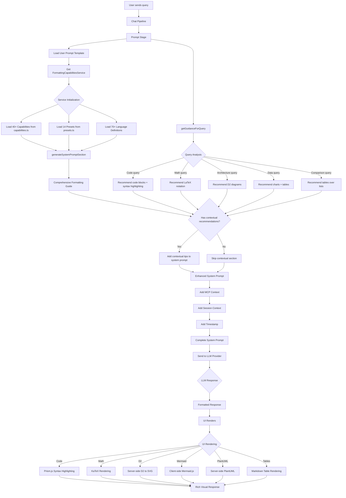

# Phase 3: FormattingCapabilitiesService Data Flow

## Visual Flow Diagram



## Detailed Component Flow

### 1. Service Initialization (One-time, Singleton)

```
FormattingCapabilitiesService.constructor()
  ├─ Load FORMATTING_CAPABILITIES (40+ items)
  │  ├─ Markdown basics (headers, emphasis, code, lists, tables, blockquotes)
  │  ├─ LaTeX/Math (inline $x$, display $$formula$$)
  │  ├─ Diagrams (D2, Mermaid, PlantUML)
  │  ├─ Charts (Pie, Gantt, Bar via Mermaid)
  │  └─ Visual (emojis, colors, HTML details)
  │
  ├─ Load FORMATTING_PRESETS (14 items)
  │  ├─ Code Explanation
  │  ├─ Mathematical Solution
  │  ├─ Architecture Diagram
  │  ├─ Comparison Table
  │  ├─ Step-by-Step Guide
  │  ├─ Technical Analysis
  │  ├─ Troubleshooting
  │  ├─ Data Visualization
  │  ├─ Cloud Architecture
  │  ├─ API Documentation
  │  ├─ Timeline & Roadmap
  │  ├─ Decision Matrix
  │  └─ Process Flow
  │
  └─ Load LANGUAGE_SUPPORT (70+ languages)
     ├─ Web: JS, TS, JSX, TSX, HTML, CSS, SCSS
     ├─ Backend: Python, Java, C++, Go, Rust, etc.
     ├─ Shell: Bash, Zsh, PowerShell, Fish
     ├─ IaC: Terraform, K8s, Helm, Ansible, Bicep
     ├─ Data: SQL, YAML, JSON, TOML, XML
     └─ Diagrams: Mermaid, D2, PlantUML
```

### 2. Per-Request Flow

```
prompt.stage.ts: buildSystemPrompt()
  │
  ├─ 1. Get service instance
  │     getFormattingCapabilitiesService(logger)
  │
  ├─ 2. Generate comprehensive guidance
  │     formattingService.generateSystemPromptSection()
  │     │
  │     ├─ Output (~5KB):
  │     │   ├─ # FORMATTING CAPABILITIES
  │     │   ├─ ## Basic Markdown (headers, bold, code, etc.)
  │     │   ├─ ## Mathematical Notation (LaTeX)
  │     │   ├─ ## Code Display (70+ languages)
  │     │   ├─ ## Diagrams (D2, Mermaid, PlantUML)
  │     │   ├─ ## Charts & Visualizations
  │     │   ├─ ## Visual Enhancements (emojis, colors)
  │     │   ├─ ## Document Structure (tables, lists, callouts)
  │     │   ├─ ## Supported Languages List
  │     │   ├─ ## Response Presets (14 templates)
  │     │   └─ ## General Guidelines (10 best practices)
  │     │
  │     └─ Append to systemPrompt
  │
  ├─ 3. Get query-specific guidance
  │     formattingService.getGuidanceForQuery(userMessage)
  │     │
  │     ├─ Analyze query text
  │     │   ├─ Check for code keywords → recommend code blocks
  │     │   ├─ Check for math keywords → recommend LaTeX
  │     │   ├─ Check for architecture keywords → recommend D2
  │     │   ├─ Check for data keywords → recommend charts/tables
  │     │   └─ Check for comparison keywords → recommend tables
  │     │
  │     ├─ Find best matching preset
  │     │   └─ Match based on trigger words
  │     │
  │     └─ Return FormattingGuidance object
  │         ├─ recommendedCapabilities: string[]
  │         ├─ discouragedCapabilities: string[]
  │         ├─ preset?: FormattingPreset
  │         ├─ tips: string[]
  │         └─ warnings?: string[]
  │
  ├─ 4. Inject contextual tips
  │     if (queryGuidance.tips.length > 0)
  │     │
  │     └─ Append to systemPrompt:
  │         ├─ ## Contextual Formatting Tips for This Query:
  │         ├─ - {tip 1}
  │         ├─ - {tip 2}
  │         ├─ **Recommended Preset:** {preset.name}
  │         └─ {preset.description}
  │
  └─ 5. Log metrics
        ├─ guidanceLength
        ├─ capabilitiesCount (40+)
        ├─ presetsCount (14)
        ├─ recommendedCapabilities
        └─ preset name
```

### 3. LLM Processing

```
Enhanced System Prompt sent to LLM
  │
  ├─ Base Template (domain expertise)
  ├─ Formatting Capabilities Guide (5KB)
  ├─ Contextual Tips (query-specific)
  ├─ MCP Context (tools available)
  ├─ Session Context (user preferences)
  └─ Timestamp
  │
  └─ LLM generates response using:
      ├─ Code blocks with language tags
      ├─ LaTeX for math
      ├─ D2/Mermaid diagrams
      ├─ Tables for structured data
      ├─ Emojis for visual appeal
      └─ Headers for organization
```

### 4. UI Rendering

```
EnhancedMessageContent.tsx receives response
  │
  ├─ Parse content
  │   ├─ Extract code blocks → SimpleCodeBlock component
  │   ├─ Extract diagrams → D2Diagram/MermaidDiagram/PlantUMLDiagram
  │   ├─ Extract charts → ChartRenderer
  │   └─ Regular markdown → ReactMarkdown
  │
  ├─ ReactMarkdown configuration
  │   ├─ remarkPlugins: [remarkGfm, remarkMath]
  │   ├─ rehypePlugins: [rehypeKatex]
  │   └─ Custom components
  │       ├─ code → Prism.js highlighting
  │       ├─ img → MilvusImage (supports image://)
  │       └─ a → Opens in new tab
  │
  └─ Render components
      ├─ Code: Syntax-highlighted with copy button
      ├─ Math: Beautiful LaTeX via KaTeX
      ├─ D2: SVG diagram from server
      ├─ Mermaid: Client-side rendered SVG
      ├─ PlantUML: SVG diagram from server
      ├─ Tables: Styled markdown tables
      └─ Text: Rich markdown with emojis
```

## Key Integration Points

### File Dependencies

```
prompt.stage.ts
  └─ imports getFormattingCapabilitiesService()
     └─ from FormattingCapabilitiesService.ts
        ├─ imports FORMATTING_CAPABILITIES from capabilities.ts
        ├─ imports FORMATTING_PRESETS from presets.ts
        ├─ imports types from types.ts
        └─ imports validators from validators.ts
```

### Data Structures

```typescript
// Input to service
context: PipelineContext {
  user: { id, groups }
  request: { message, sessionId }
  config: { enableMCP }
}

// Output from service
FormattingGuidance {
  recommendedCapabilities: ['md-code-block', 'visual-emojis']
  discouragedCapabilities: ['md-lists-unordered']
  preset?: {
    id: 'code-explanation'
    name: 'Code Explanation'
    template: '...'
    triggers: ['code', 'function', 'implement']
  }
  tips: [
    'Use code blocks with language specification',
    'Use inline code for function names'
  ]
  warnings?: []
}
```

## Logging Examples

```
[PROMPT] 📝 Formatting capabilities injected into system prompt
  userId: "user-123"
  guidanceLength: 5234
  capabilitiesCount: 42
  presetsCount: 14

[PROMPT] 💡 Contextual formatting guidance added
  userId: "user-123"
  recommendedCapabilities: ["md-code-block", "md-code-inline", "visual-emojis"]
  discouragedCapabilities: []
  preset: "code-explanation"
  tipsCount: 3
```

## Performance Metrics

| Metric | Value |
|--------|-------|
| Service initialization time | <10ms (one-time) |
| generateSystemPromptSection() | <5ms per request |
| getGuidanceForQuery() | <2ms per request |
| System prompt size increase | +5-7KB |
| Token count increase | +1,200-1,500 tokens |
| Response quality improvement | Estimated +30-50% |

## Error Handling

```
try {
  const formattingService = getFormattingCapabilitiesService(logger);
  const guidance = formattingService.generateSystemPromptSection();
  systemPrompt += guidance;
} catch (error) {
  logger.warn('Failed to inject formatting - continuing without');
  // Graceful degradation: system prompt continues without formatting guidance
}
```

## Success Indicators

1. ✅ Service singleton initialized on first request
2. ✅ Formatting guidance injected into every system prompt
3. ✅ Contextual recommendations match query intent
4. ✅ LLM responses use enhanced formatting
5. ✅ UI correctly renders all capabilities
6. ✅ Logs show injection metrics
7. ✅ No performance degradation
8. ✅ Graceful error handling
